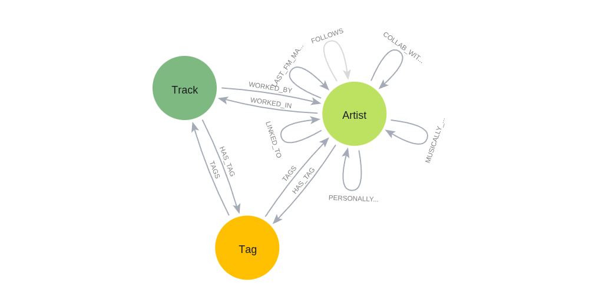

## Schema

Schema visualization (purple -> Artist):



**For more stats and for plots see *stats.ipynb*.**

- **Artist**:
    - MusicBrainz:
        - *begin_dates* (list of integers): All the instances of *begin_year* in MusicBrainz.
        - *main_id* (string): Primary key, UUID, main id, call it however you want.
            - Corresponds to the most common ID in MusicBrainz.
        - *known_ids* (list of strings): List of all IDs of all the instances of the artist in MusicBrainz.
        - *known_names* (list of strings): List of names of all the instances of the artist in MusicBrainz.
        - *ended* (float 0.0-1.0): Proportion of true values in MusicBrainz for the *ended* column throughout all its instances.
            - *ended* can mean death, a dissolved band...
            - The meaning depends on the instance type. For humans they're typically birth dates. For bands, creation date.
        - *end_dates* (list of integers): Similar to *begin_dates* but viceversa.
        - *gender_\** (one-hot enconding): Gender/Sex of the artist.
            - *gender_1* means male.
            - *gender_2* means female.
            - *gender_3* means other.
            - *gender_4* means not applicable.
            - *gender_5* means non-binary.
        - *type_\** (one-hot enconding): Type of artist.
            - *type_1* means person.
            - *type_2* means group.
            - *type_3* means other.
            - *type_4* means character.
            - *type_5* means orchestra.
            - *type_6* means choir.
    - LastFM:
        - *last_fm_call* (boolean): If I've tried to extract information from LastFM about this node.
        - *in_last_fm* (boolean): If I've successfully extracted information from LastFM about this node.
        - *listeners* (integer): Sum of all the instances of the artist's listeners in LastFM.
        - *playcount* (integer): Sum of all the instances of the artist's playcount in LastFM.

- **Track**:
    - MusicBrainz:
        - *artist_count* (integer): Number of artists involved in the track.
        - *id* (string): Primary key, UUID, main id, call it however you want.
        - *month* (integer): Release month (or 13 if no info).
        - *name* (string): Name of the track in MusicBrainz.
        - *year* (integer): Release year (or 0 if no info).
    - LastFM:
        - *in_last_fm* (boolean): If I've successfully extracted information from LastFM about this node.
        - *last_fm_call* (boolean): If I've tried to extract information from LastFM about this node.
        - *listeners* (integer): Sum of all the instances of the track's listeners in LastFM.
        - *playcount* (integer): Sum of all the instances of the track's playcount in LastFM.

- **Tag**:
    - MusicBrainz:
        - *id* (string): Primary key, UUID, main id, call it however you want.
        - *name* (string): Name of the tag.

- **Relationships**:
    - MusicBrainz:
        - *WORKED_IN*: *Artist* to *Track*. Its inverse is *WORKED_BY*.
        - *WORKED_BY*.
        - *COLLAB_WITH*: *Artist* to *Artist*. Its inverse is itself.
            - `count`: Number of collaborations.
        - *MUSICALLY_RELATED_TO*: *Artist* to *Artist*. Its inverse is itself.
            - `count`: Number of times that an entity of artist a was musically related to an entity of artist b in MusicBrainz's DB.
            - Relationship types 102, 103, 104, 105, 106, 107, 108, 305, 728, 855 and 965 in MB's DB.
        - *PERSONALLY_RELATED_TO*: *Artist* to *Artist*. Its inverse is itself.
            - `count`: Number of times that an entity of artist a was personally related to an entity of artist b in MusicBrainz's DB.
            - Relationship types 109, 110, 111, 112, 113, 292, 973 and 1079 in MB's DB.
        - *LINKED_TO*: *Artist* to *Artist*. Its inverse is itself.
            - `count`: Number of times that an entity of artist a was related to an entity of artist b, excluding the relations specified in the other *\*_RELATED_TO* relationships.
            - Relationship types 722, 847, 895 in MB's DB.
    - LastFM:
        - *LAST_FM_MATCH*: *Artist* to *Artist*. Its inverse is itself.
            - `weight`: 0.0 to 1.0 similar artist score.
    - Both (although tags come from MB):
        - *HAS_TAG*: *Artist* or *Track* to *Tag*. Its inverse is *TAGS*.
        - *TAGS*.

All relationships/edges have a `pg_weight` field:

```cypher
MATCH ()-[r]->()
SET r.pg_weight = CASE
    WHEN r.weight IS NOT NULL THEN r.weight
    WHEN r.count IS NOT NULL THEN r.count
    ELSE 1
END
```
