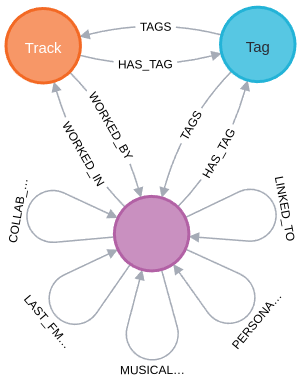

## Schema

Schema visualization (purple -> Artist):

{ style="display: block; margin: 0 auto" }

**For more stats and for plots see *stats.ipynb*.**

- **Artist**: 
    - *main_id* (string): Primary key, UUID, main id, call it however you want.
        - Corresponds to the most common ID in MusicBrainz.
    - *known_ids* (list of strings): List of all IDs of all the instances of the artist in MusicBrainz.
    - *known_names* (list of strings): List of names of all the instances of the artist in MusicBrainz.
    - *last_fm_call* (boolean): If I've tried to extract information from LastFM about this node.
    - *in_last_fm* (boolean): If I've successfully extracted information from LastFM about this node.
    - *listeners* (integer): Sum of all the instances of the artist's listeners in LastFM.
    - *playcount* (integer): Sum of all the instances of the artist's playcount in LastFM.
    - *ended* (float 0.0-1.0): Proportion of true values in MusicBrainz for the *ended* column throughout all its instances.
        - *ended* can mean death, a dissolved band...
    - *begin_dates* (list of integers): All the instances of *begin_year* in MusicBrainz.
        - The meaning depends on the instance type. For humans they're typically birth dates. For bands, creation date.
    - *end_dates* (list of integers): Similar to *begin_dates* but viceversa.
    - *gender_\** (one-hot enconding): Gender of the artist. Animal gender.
        - *gender_1* means male.
        - *gender_2* means female.
        - *gender_3* means other.
        - *gender_4* means not applicable.
        - *gender_5* means non-binary.
    - *type_\** (one-hot enconding): Type of artist.
        - *type_1* means person.
        - *type_2* means group.
        - *type_3* means other.
        - *type_4* means character.
        - *type_5* means orchestra.
        - *type_6* means choir.

- **Release**: 
    - *id* (string): Primary key, UUID, main id, call it however you want.
    - *name* (string): Name of the release in MusicBrainz.
    - *last_fm_call* (boolean): If I've tried to extract information from LastFM about this node.
    - *in_last_fm* (boolean): If I've successfully extracted information from LastFM about this node.
    - *listeners* (integer): Sum of all the instances of the release's listeners in LastFM.
    - *playcount* (integer): Sum of all the instances of the release's playcount in LastFM.
    - *artist_count* (integer): Number of artists involved in the release.
    - *date* (string): Release date in YYYY-MM-DD format.

- **Tag**: 
    - *id* (string): Primary key, UUID, main id, call it however you want.
    - *name* (string): Name of the tag.

- **Relationships** **TODO**
